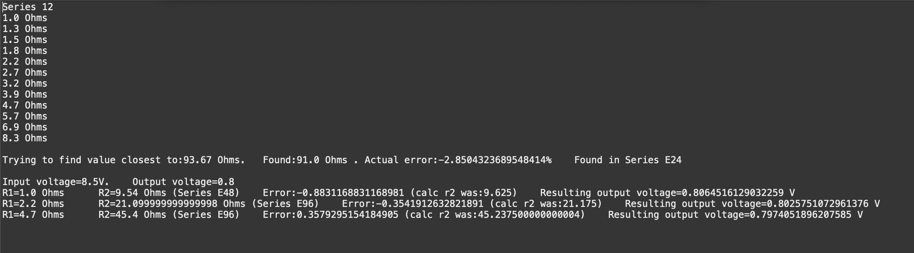

# Resistors
A collection of algorithms helping to calculate the properties of resistors. E.g. find the closest value of a standard resistor within a given error margin for a resistance needed. The tool will tell you the standard value and the first standard series in which it was found.

[Voltage Divider App, an App I wrote, you might want to check it out...](https://play.google.com/store/apps/details?id=com.berthold.voltagedivider)

